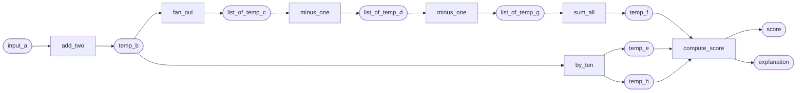

# Multithreading execution of a DAG of functions

We have these functions:

```python
import random

def add_two(input_a):
    temp_b = input_a + 2
    return temp_b


def fan_out(temp_b):
    if temp_b == 3:
        fanout_factor = 3
    else:
        fanout_factor = random.randint(1, 6)

    list_of_temp_c = [temp_b + 1] * fanout_factor

    return list_of_temp_c


def minus_one(temp_c):
    temp_d = temp_c - 1
    return temp_d


def by_ten(a_parameter):
    temp_e = a_parameter * 10
    temp_h = a_parameter * 10 * 10
    return temp_e, temp_h


def sum_all(list_of_temp_g):
    final_f = sum(list_of_temp_g)

    print('sum_all', list_of_temp_g, ' => ', final_f)
    return final_f

def compute_score(temp_e, temp_f, temp_h):
    score = temp_e + temp_f + temp_h
    explanation = f'score components E: {temp_e} F:{temp_f} G:{temp_h}'
    return score, explanation
```

and they need to be steps combined in a DAG this way:




that can be done, synchronously:

```python
def process_all():
    input_a = 1
    temp_b = add_two(input_a)
    list_of_temp_c = fan_out(temp_b)
    list_of_temp_d = map(minus_one, list_of_temp_c)
    list_of_temp_g = map(minus_one, list_of_temp_d)
    temp_e, temp_h = by_ten(temp_b)
    temp_f = sum_all(list_of_temp_g)
    score, explanation = compute_score(temp_e, temp_f, temp_h)
    print(score, '|', explanation)
```

or using concurrent futures.

```python

def using_futures():

def using_futures():
    input_a = 1

    # Create a ThreadPoolExecutor to run functions concurrently
    with concurrent.futures.ThreadPoolExecutor() as executor:

        future_vars = {}
        d_futures = []
        g_futures = []
        final_stage_queue = mp.Queue()

        future_vars['B'] = executor.submit(add_two, input_a)

        def b_ready(future_b):
            future_vars['C'] = executor.submit(fan_out, future_b.result())
            future_vars['E_H'] = executor.submit(by_ten, future_b.result())
            final_stage_queue.put('processing e_h')

        future_vars['B'].add_done_callback(b_ready)

        def c_ready(future_c):

            def run_first_minus_submit_second(c_element):
                d = minus_one(c_element)
                g_element_future = executor.submit(minus_one, d)
                g_futures.append(g_element_future)

            for c_element in future_c.result():
                d_element_future = executor.submit(run_first_minus_submit_second, c_element)
                d_futures.append(d_element_future)

            concurrent.futures.wait(g_futures)
            concurrent.futures.wait(d_futures)

            list_of_g = list(g.result() for g in g_futures)
            future_vars['F'] = executor.submit(sum_all, list_of_g)
            final_stage_queue.put('processing f')

        future_vars['C'].add_done_callback(c_ready)

        while 'F' not in future_vars or 'E_H' not in future_vars:
            final_stage_queue.get()

        temp_e, temp_h = future_vars['E_H'].result()
        temp_f = future_vars['F'].result()

        score, explanation = compute_score(temp_e, temp_f, temp_h)
        print(score, '|', explanation)

```

1. Each step needs to run in its own thread. We cannot use asyncio because some steps will use third-party libraries that don't support asyncio.
2. Use cases range from real-time scenarios where the entire DAG needs to run in less than a second, to some short-lived background processing where it can take up to 1 minute. 
3. In the event of a failure in a step, the entire DAG can be discarded. We don't need to handle retries
4. Everything should run in a single machine, keeping intermediate results in memory,  without requiring external storage or additional services.
5. In the example each instance of `minus_one`, applied to an element D should start in a single thread as soon as that element D is available, without waiting for the entire list of Ds. 
6. "sum_all" must wait for the entire list of G to be available, and will do it in a single run. We don't need the "reduce" part of map-reduce.
7. When waiting for several upstream variables to be ready, eg. for starting "sum_all" or "compute_score", the signaling or blocking mechanism shouldn't add unneeded latency. Meaning it cannot use loops with time.sleep, no matter how short the sleep. But instead, it should rely on mechanisms like concurrent.futures.wait, multiprocessing.Queue, or Threads join().
8. There should be minimal, ideally zero, transient dependencies added to the project by the lib.
9. Having the ability for some steps to run in its own process is a nice-to-have.

Which library has a simple, declarative way to define a DAG like that and will execute each step as soon as all its inputs are available?

## Possible solutions and non-solutions to explore

Dask: best candidate. need to figure out how to handle arbitrary size of `fan_out` output.

Joblib: PENDING. doesn't seem to have the concept of a DAG.

aiodag: DISCARDED. Uses asyncio, but it is really close. https://github.com/sds9995/aiodag

Celery: DISCARDED. It needs a broker with persistence. It has an "in-memory" broker but is aimed only for internal unit tests.
Prefect: DISCARDED. Too heavy. Uses Dask as local executor.
Luigi: DISCARDED. Airflow style
